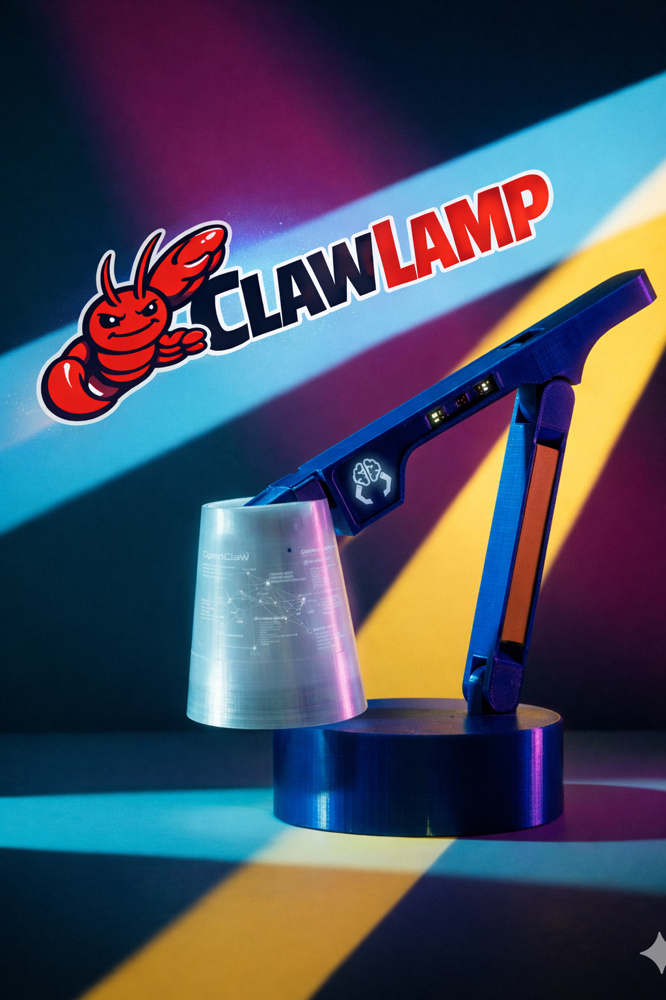

# ClawLamp

ClawLamp 是一款内置OpenClaw的智能台灯，是您桌面的智能助理。 
  当前实现能力： 
  - LED灯控制，通过LED矩阵阵列和颜色变换实现不同的交互
  - 整合了飞书Channal，可以通过飞书和ClawLamp互动，询问工作日程，查收邮件等。 

  

## 硬件
- 3D打印件
- 树莓派4B
- LED矩阵
- 喇叭

## TODO
- 增加Camera ，可以通过ORC识别您的发票和数据信息，和飞书的财务报销和表格打通，更加方便您的办公。
- 前台无人助理，通过摄像头识别进门人员，根据不同人员触发不同的互动
